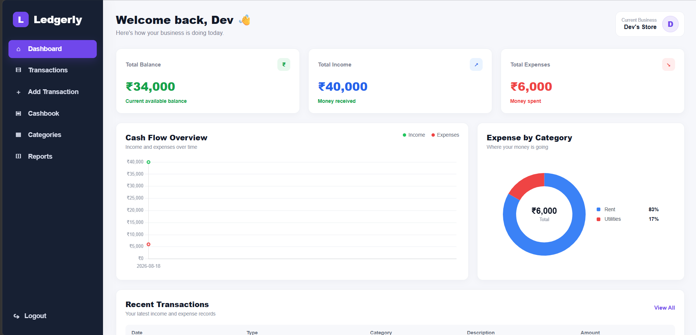
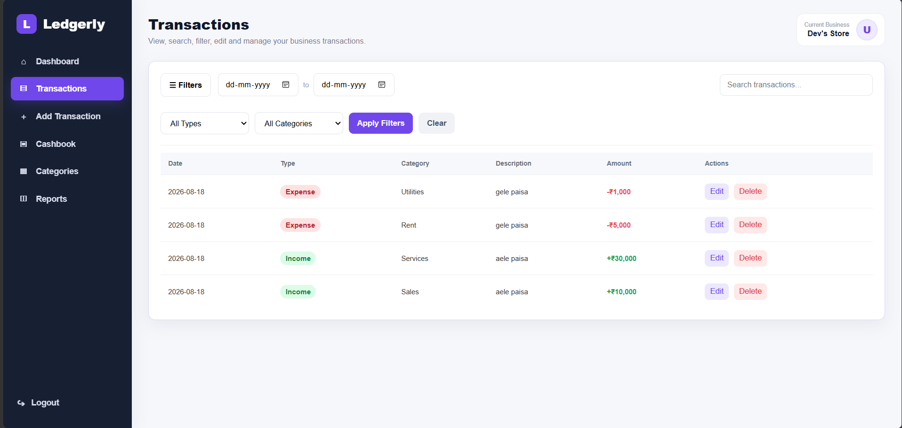
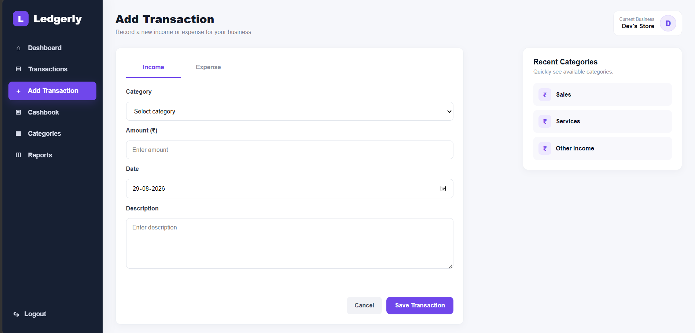
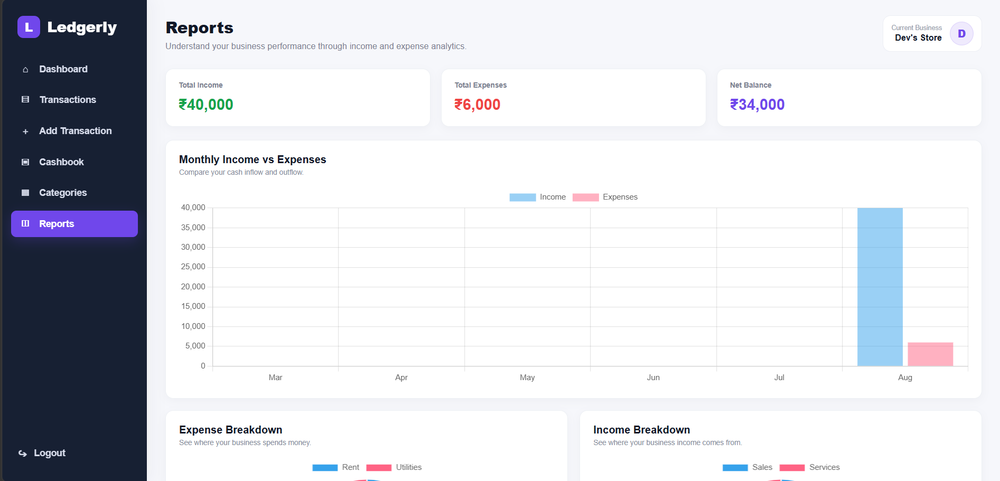

# 💰 Ledgerly

Ledgerly is a full-stack **small-business cashbook and financial tracking application** built with **Python, FastAPI, PostgreSQL, HTML, CSS, and JavaScript**.

It helps users record income and expenses, organize transactions using custom categories, monitor financial activity through a dashboard, and view reports — all through a simple web interface.

## 🚀 Live Demo

**Application:**
https://ledgerly-fsjx.onrender.com

**API Documentation:**
https://ledgerly-fsjx.onrender.com/docs

> The application is hosted on Render's free tier, so the first request may take a few seconds while the service wakes up.

---

## ✨ Features

### 🔐 User Authentication

* User registration and login
* Secure password hashing using bcrypt
* JWT-based authentication
* Protected user-specific data
* Persistent login using browser storage

### 📊 Dashboard

* Overview of financial activity
* Total income
* Total expenses
* Current balance
* Recent transaction information

### 💵 Cashbook & Transactions

* Add income and expense transactions
* View transaction history
* Edit existing transactions
* Delete transactions
* Add descriptions to transactions
* Associate transactions with categories
* Search and filter transaction records

### 🏷️ Category Management

* Create custom income and expense categories
* Edit categories
* Delete unused categories
* Categories are isolated per user
* Prevents deletion of categories currently being used by transactions
* Prevents duplicate category names for the same user

### 🔎 Transaction Filtering

Transactions can be filtered using:

* Search text
* Transaction type
* Category
* Start date
* End date

### 📈 Reports

Financial reports provide users with a clearer view of their recorded income and expenses.

---

## 📸 Screenshots

### Dashboard



### Transactions



### Add Transaction



### Reports



---

## 🛠️ Tech Stack

### Backend

* Python
* FastAPI
* SQLAlchemy
* Pydantic
* Alembic
* JWT Authentication
* bcrypt

### Database

* PostgreSQL — production
* SQLite — local development / initial development

### Frontend

* HTML
* CSS
* JavaScript

### Deployment & Development

* Render
* Git
* GitHub
* PyCharm

---

## 🏗️ Project Architecture

```text
Ledgerly/
│
├── app/
│   ├── models/
│   ├── routers/
│   ├── schemas/
│   ├── database.py
│   ├── security.py
│   └── main.py
│
├── frontend/
│   ├── css/
│   │   └── style.css
│   │
│   ├── js/
│   │   ├── auth.js
│   │   ├── dashboard.js
│   │   ├── transactions.js
│   │   ├── categories.js
│   │   ├── reports.js
│   │   ├── cashbook.js
│   │   └── add-transaction.js
│   │
│   ├── login.html
│   ├── dashboard.html
│   ├── transactions.html
│   ├── cashbook.html
│   ├── add-transaction.html
│   ├── categories.html
│   └── reports.html
│
├── alembic/
├── alembic.ini
├── requirements.txt
├── .gitignore
└── README.md
```

> The exact structure may evolve as Ledgerly is improved.

---

## ⚙️ Local Installation

### 1. Clone the repository

```bash
git clone <your-repository-url>
cd Ledgerly
```

### 2. Create a virtual environment

```bash
python -m venv .venv
```

### 3. Activate the virtual environment

**Windows PowerShell**

```powershell
.venv\Scripts\Activate.ps1
```

### 4. Install dependencies

```bash
pip install -r requirements.txt
```

### 5. Configure environment variables

Create a `.env` file in the project directory.

Example:

```env
DATABASE_URL=your_database_connection_string
SECRET_KEY=your_secret_key
```

Never commit the `.env` file or production credentials to GitHub.

### 6. Run database migrations

```bash
alembic upgrade head
```

### 7. Start the FastAPI application

```bash
uvicorn app.main:app --reload
```

Open the application in your browser:

```text
http://127.0.0.1:8000
```

FastAPI documentation:

```text
http://127.0.0.1:8000/docs
```

---

## 🔌 Main API Functionality

Ledgerly provides API endpoints for:

* User registration
* User login
* Current-user authentication
* Creating transactions
* Reading transactions
* Updating transactions
* Deleting transactions
* Creating categories
* Reading categories
* Updating categories
* Deleting categories
* Dashboard statistics
* Financial reports

Interactive API documentation is available through FastAPI Swagger UI at `/docs`.

---

## 🗄️ Database & Migrations

Ledgerly uses **SQLAlchemy** for database interaction and **Alembic** for schema migrations.

The project initially used SQLite during development and was later migrated to PostgreSQL for deployment.

This allows database schema changes to be tracked and applied consistently between development and production environments.

---

## 🔒 Security

Ledgerly implements:

* Password hashing using bcrypt
* JWT access tokens
* Protected API endpoints
* User-specific transactions
* User-specific categories
* Environment variables for sensitive configuration

Passwords are never stored as plain text.

---

## 💡 What I Learned

Building Ledgerly provided practical experience with:

* Designing REST APIs with FastAPI
* Connecting a frontend to backend APIs
* CRUD operations
* Relational database design
* SQLAlchemy ORM
* Database migrations with Alembic
* JWT authentication
* Password hashing
* User-specific database records
* Input validation
* Error handling
* PostgreSQL deployment
* Environment variables
* Git and GitHub workflow
* Deploying a full-stack application

---

## 🔮 Future Improvements

Possible future additions include:

* Monthly budgeting
* Downloadable financial reports
* CSV/PDF exports
* Interactive charts
* Recurring transactions
* Improved analytics
* Password reset functionality
* Email verification
* Mobile-responsive improvements

---

## 👨‍💻 Author

**Dev Shah**

Built as a full-stack Python project focused on learning backend development, database management, authentication, API development, and deployment.
